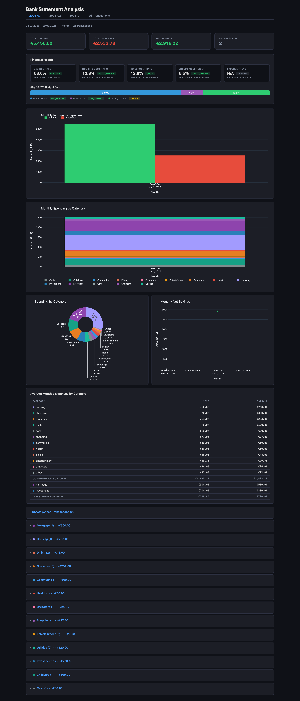

# ing-bankstats

A CLI tool that reads **ING Bank Germany** CSV transaction exports, categorises
each transaction by keyword rules, and produces a **self-contained interactive
HTML report** with four Plotly charts and a summary table.

DISCLAIMER: This project served as a playground for me to experiment with `claude code`.

## Requirements

- Python 3.11+

## Installation

```bash
pip install -e ".[dev]"
```

This installs the `visualise` command globally in the active Python environment.

## Usage

```bash
# Basic – output written next to the input file as <name>.html
visualise data/umsatzanzeige.template.csv

# Custom output path
visualise data/umsatzanzeige.template.csv -o /tmp/report.html

# Open the report in your browser immediately
visualise data/umsatzanzeige.template.csv --open

# Use a custom categories file
visualise data/umsatzanzeige.template.csv -c my_categories.yaml

# Exclude own-account transfers by merchant name (repeatable)
visualise transactions.csv -a "My Savings Account" -a "Shared Account"

# All options together
visualise transactions.csv -o report.html -c categories.yaml -a "John Doe" --open
```

## Report Contents

| Section | Description |
|---|---|
| **Summary bar** | Date range · months · transactions · totals · averages |
| **Monthly Income vs Expenses** | Grouped bar chart |
| **Monthly Spending by Category** | Stacked bar chart |
| **Category Breakdown** | Donut chart |
| **Monthly Net Savings** | Line chart |
| **Financial Health** | Savings rate · housing ratio · investment rate · Engel's coefficient · 50/30/20 rule · expense trend |
| **Uncategorised Transactions** | Collapsible table for keyword tuning |

All charts are interactive (hover, zoom, legend toggle). The HTML file is
fully self-contained — no network requests needed.

## Example Report



Generated from the included demo data: `visualise data/demo.csv`

## Customising Categories

Copy the bundled config and edit it:

```bash
cp config/categories.yaml my_categories.yaml
# edit my_categories.yaml …
visualise transactions.csv -c my_categories.yaml
```

Each category has a list of **keywords** (case-insensitive, regex-escaped).
The tool searches both the *merchant* and *reference* columns. Categories higher
in the file take priority when a transaction matches multiple categories.

```yaml
# Filter out inter-account transfers (matched by merchant name, case-insensitive)
own_accounts:
  - "My Savings Account"
  - "Shared Account"

categories:
  housing:
    color: "#a29bfe"
    benchmark_group: housing   # used for housing cost ratio
    budget_bucket: needs       # for 50/30/20 rule
    keywords: [hausgeld, miete, nebenkosten]

  groceries:
    color: "#e67e22"
    benchmark_group: food      # used for Engel's coefficient
    budget_bucket: needs
    keywords: [rewe, edeka, lidl]

  mortgage:
    color: "#8e44ad"
    type: investment           # counts toward investment rate, not housing
    budget_bucket: savings
    keywords: [tilgung, baufinanzierung]

  other:
    color: "#95a5a6"
    keywords: []   # catch-all fallback — always last
```

Optional fields:

- **`own_accounts`** — merchant names for inter-account transfers (excluded from all calculations). Can also be passed via `--own-accounts` / `-a` on the CLI; values are merged.
- **`benchmark_group`** — groups categories for Financial Health ratios (`housing` → housing cost ratio, `food` → Engel's coefficient).
- **`type`** — `investment` vs default `consumption`; affects the investment rate calculation.
- **`budget_bucket`** — `needs` / `wants` / `savings` for the 50/30/20 rule.

## Development

```bash
# Run all tests
pytest tests/ -v

# With coverage
pytest tests/ -v --cov=ing_bankstats --cov-report=term-missing

# End-to-end smoke test
visualise data/umsatzanzeige.template.csv --open
```

## Project Structure

```
src/ing_bankstats/
├── cli.py          # Click entry point
├── parser.py       # CSV ingestion + German locale parsing
├── categorizer.py  # Keyword-based categorisation
├── aggregator.py   # Monthly/category aggregations
├── charts.py       # Plotly chart builders
├── report.py       # Jinja2 HTML assembly
└── assets/
    ├── report.html.j2   # HTML template
    └── categories.yaml  # Bundled default categories
config/
└── categories.yaml      # User-editable copy (same as bundled default)
tests/
├── conftest.py
├── test_parser.py
├── test_categorizer.py
├── test_aggregator.py
└── fixtures/sample.csv
```
